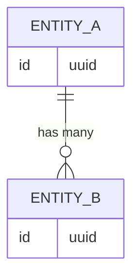

# Data Model

> Schema definitions, entity relationships, and field descriptions.
> Agent reads this before any task touching the database.
> Agent updates this when schema changes are made.

## Entity Relationship Overview

<!-- Agent adds a Mermaid ER diagram here once the schema is known -->

---

## Entities

<!-- One section per table / collection / model -->

<!-- Template:

### EntityName

| Field | Type | Required | Description |
|---|---|---|---|
| id | uuid | Yes | Primary key |
| created_at | timestamp | Yes | Auto-set on insert |

**Indexes:** `(field1, field2)`
**Constraints:** ...
**Notes:** Any non-obvious behavior

-->

---

## Migration History

> Summary of significant schema changes. Not a replacement for migration files.

| Date | Change | Plan |
|---|---|---|
| <!-- YYYY-MM-DD --> | <!-- description --> | <!-- #N --> |

---

## Conventions

<!-- e.g. All tables have id (uuid), created_at, updated_at -->
<!-- e.g. Soft deletes via deleted_at column -->
<!-- e.g. Enum values stored as strings -->

## Related
- [[wiki/architecture/overview]]
- [[wiki/modules/_index]]
